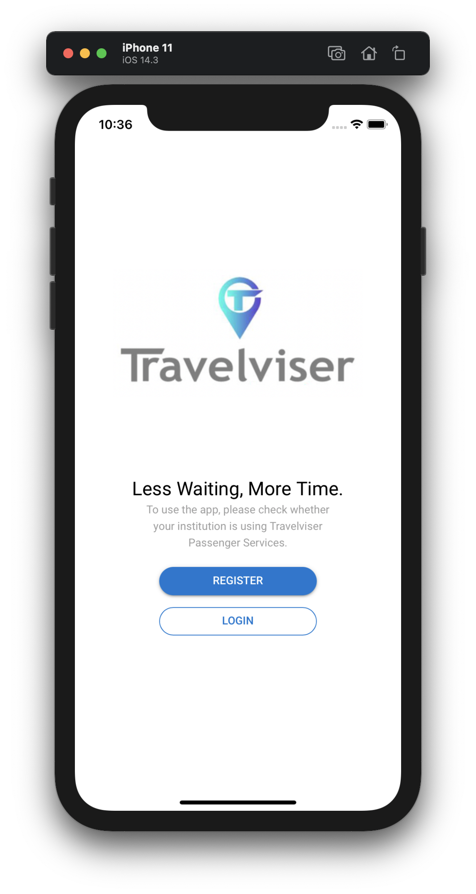
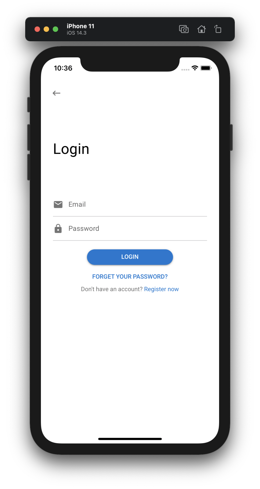
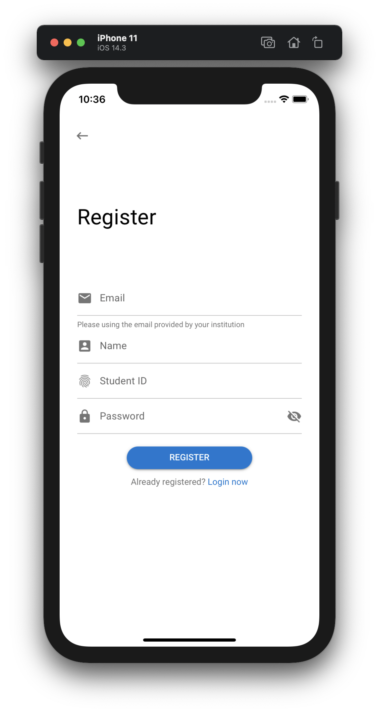
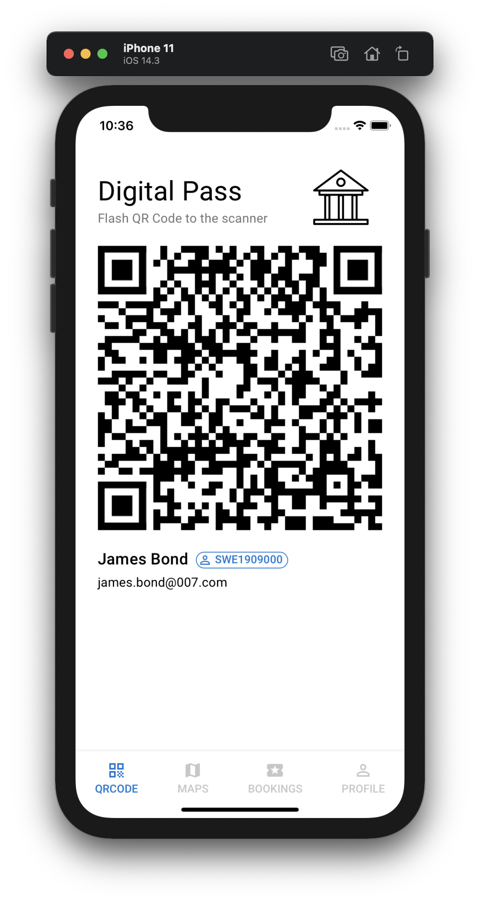
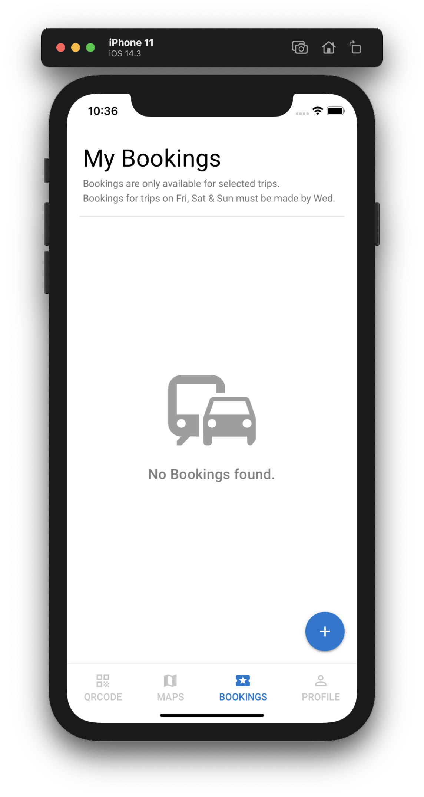
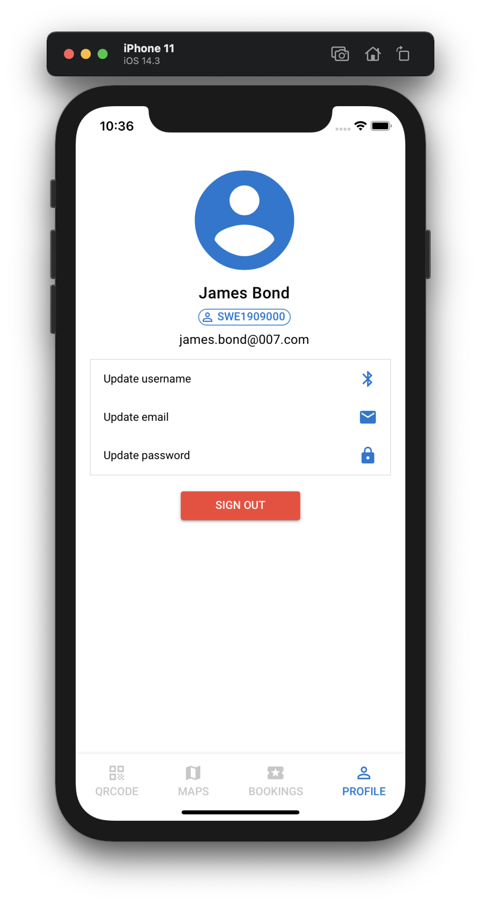

# :bus::palm_tree: Travelviser Mock-up

A Quasar Framework app, mock-up of Travelviser Passenger.

This repository is for the coursework of Human Computer Interaction, building a mockup user interface for a poor design app named Travelviser Passenger. 

:warning: **Reminder:** This project is for academic use only and no commercial use is permitted.

:copyright: License by [Apache-2.0 License](https://github.com/jukrb0x/travelviser-mockup/blob/master/LICENSE)

## :rocket: Getting started

### Install dependencies

```bash
yarn
```

### Start the development mode

H5(spa), iOS, Android, Electron...

### H5

```bash
quasar dev
```

### iOS

```shell
quasar dev -m ios
quasar dev -m ios -e iPhone-11 # specify the model
```

### Android

```shell
quasar dev -m android
```

### Build

```bash
quasar build
```

### :gear: Customize the configuration

See [Configuring quasar.conf.js](https://quasar.dev/quasar-cli/quasar-conf-js).

# :iphone: Screenshots

<center>






</center>

# :bird: To-do

*I probably won’t take action on these to-dos*

- [ ] Body lock (v-body-lock) for layout implement
- [ ] Maps components
- [ ] Bookings function